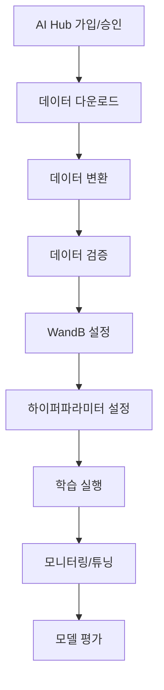

# 🔥 AI Hub 데이터 → 학습 완전 가이드

**AI Hub 화재 감지 데이터셋**을 사용하여 모델을 학습시키는 전체 과정을 단계별로 안내합니다.

---

## 📋 전체 진행 순서



---

## 🚀 Step 1: 사전 준비

### 1.1 환경 확인
```bash
# 프로젝트 디렉토리로 이동
cd /Users/hyunwoo/Desktop/FireSmokeDetection

# 가상환경 활성화
source venv/bin/activate

# 필수 패키지 확인
pip install -r requirements.txt
```

### 1.2 디렉토리 구조 생성
```bash
# 데이터 저장 디렉토리 생성
mkdir -p data/{aihub_raw,fire_smoke}
mkdir -p outputs/{checkpoints,logs,visualizations}

# 권한 확인
chmod +x run_demo.sh
```

---

## 📂 Step 2: AI Hub 데이터 다운로드

### 2.1 AI Hub 가입 및 승인
1. **AI Hub 웹사이트 접속**: https://aihub.or.kr
2. **회원가입** (한국인만 가능)
3. **데이터셋 페이지 이동**: https://aihub.or.kr/aihubdata/data/view.do?dataSetSn=176
4. **데이터 신청** → 승인 대기 (보통 1-2일)
5. **승인 완료 후 다운로드 가능**

### 2.2 데이터 다운로드 및 압축 해제
```bash
# AI Hub에서 다운로드한 파일들을 data/aihub_raw/에 저장
# 예시 경로: /Users/hyunwoo/Desktop/FireSmokeDetection/data/aihub_raw/

# 분할 압축된 경우 병합
cd data/aihub_raw/
cat fire_detection_*.zip.* > fire_detection_complete.zip

# 압축 해제
unzip fire_detection_complete.zip

# 최종 구조 확인
ls -la
# 예상 구조:
# ├── annotations.json        (어노테이션 파일)
# ├── images/                 (이미지 폴더)
# │   ├── train/
# │   ├── val/
# │   └── test/
# └── metadata.json           (메타데이터)
```

### 2.3 데이터 구조 확인
```bash
# 어노테이션 파일 확인
head -20 data/aihub_raw/annotations.json

# 이미지 개수 확인
find data/aihub_raw/images -name "*.jpg" | wc -l

# 용량 확인
du -sh data/aihub_raw/
```

---

## 🔄 Step 3: 데이터 형식 변환

### 3.1 AI Hub → YOLO 형식 변환
```bash
# 변환 스크립트 실행
python data_preparation/convert_aihub.py \
  --input_json data/aihub_raw/annotations.json \
  --input_images data/aihub_raw/images/ \
  --output_dir data/fire_smoke/ \
  --train_ratio 0.8 \
  --val_ratio 0.1

# 변환 결과 확인
ls -la data/fire_smoke/
# 예상 구조:
# ├── train/
# │   ├── images/
# │   └── labels/
# ├── val/
# │   ├── images/
# │   └── labels/
# ├── test/
# │   ├── images/
# │   └── labels/
# └── dataset.yaml
```

### 3.2 변환 상태 확인
```bash
# 변환된 데이터 통계
echo "=== 데이터 변환 결과 ==="
echo "Train images: $(ls data/fire_smoke/train/images/ | wc -l)"
echo "Train labels: $(ls data/fire_smoke/train/labels/ | wc -l)"
echo "Val images: $(ls data/fire_smoke/val/images/ | wc -l)"
echo "Val labels: $(ls data/fire_smoke/val/labels/ | wc -l)"
echo "Test images: $(ls data/fire_smoke/test/images/ | wc -l)"
echo "Test labels: $(ls data/fire_smoke/test/labels/ | wc -l)"
```

---

## ✅ Step 4: 데이터 검증

### 4.1 데이터셋 품질 검증
```bash
# 전체 데이터셋 검증
python data_preparation/validate_dataset.py \
  --data_dir data/fire_smoke/ \
  --check_labels

# 예상 출력:
# === Dataset Structure Validation ===
# ✓ train/images: XXXX files
# ✓ train/labels: XXXX files
# ...
# === Label Format Validation ===
# Class Distribution:
#   fire: XXXX
#   smoke: XXXX
#   ...
```

### 4.2 샘플 시각화
```bash
# 훈련 데이터 샘플 시각화
python data_preparation/validate_dataset.py \
  --data_dir data/fire_smoke/ \
  --visualize_samples 20 \
  --split train

# 검증 데이터 샘플 시각화
python data_preparation/validate_dataset.py \
  --data_dir data/fire_smoke/ \
  --visualize_samples 10 \
  --split val

# 시각화 결과 확인
ls outputs/visualizations/
# sample_visualization_train.png
# sample_visualization_val.png
```

---

## 📊 Step 5: WandB 모니터링 설정

### 5.1 WandB 로그인
```bash
# WandB 로그인 (처음 한 번만)
wandb login

# API 키 입력 (https://wandb.ai/settings에서 확인)
# 또는 환경변수로 설정
# export WANDB_API_KEY="your_api_key_here"
```

### 5.2 WandB 설정 확인
```bash
# 설정 파일 확인
cat configs/model_config.yaml | grep -A 5 "wandb:"

# 출력 예시:
# wandb:
#   enabled: true
#   project: "FireSmoke"
#   entity: "hyunwoo220"
```

---

## 🎛️ Step 6: 하이퍼파라미터 설정

### 6.1 기본 설정 확인
```bash
# 현재 설정 확인
cat configs/model_config.yaml

# Mac M3 Max 최적화 설정으로 수정
vim configs/model_config.yaml
```

### 6.2 Mac M3 Max 권장 설정
```yaml
# configs/model_config.yaml에서 수정할 부분

training:
  batch_size: 64              # 64GB RAM 활용
  epochs: 200                 # 충분한 학습
  learning_rate: 0.02         # 큰 배치에 맞는 학습률
  
model:
  input_size: 640             # MPS 최적화 크기

wandb:
  enabled: true               # WandB 활성화
  project: "FireSmoke"
  entity: "hyunwoo220"

experiment_name: "aihub_m3max_v1"  # 실험 이름
```

---

## 🚀 Step 7: 학습 실행

### 7.1 학습 시작
```bash
# 학습 실행 (백그라운드)
nohup python scripts/train/train.py \
  --config configs/model_config.yaml \
  > training_log.txt 2>&1 &

# 또는 포그라운드에서 실행
python scripts/train/train.py --config configs/model_config.yaml
```

### 7.2 학습 상태 확인
```bash
# 실시간 로그 확인
tail -f training_log.txt

# GPU/MPS 사용률 확인
top -pid $(pgrep -f "train.py")

# 체크포인트 확인
ls -la outputs/checkpoints/
```

### 7.3 모니터링
```bash
# TensorBoard 실행 (새 터미널)
tensorboard --logdir outputs/logs --port 6006

# WandB 웹 확인
# https://wandb.ai/hyunwoo220/FireSmoke
```

---

## 📈 Step 8: 학습 모니터링 및 튜닝

### 8.1 실시간 모니터링 지표
- **TensorBoard**: http://localhost:6006
- **WandB**: https://wandb.ai/hyunwoo220/FireSmoke

**주요 확인 지표**:
- Train/Val Loss 곡선
- Learning Rate 스케줄
- GPU/MPS 메모리 사용량
- 배치당 처리 시간

### 8.2 하이퍼파라미터 조정
```bash
# 학습 중단 (Ctrl+C 또는 kill)
pkill -f "train.py"

# 설정 파일 수정
vim configs/model_config.yaml

# 새로운 실험 이름으로 재시작
# experiment_name: "aihub_m3max_v2"
python scripts/train/train.py --config configs/model_config.yaml
```

---

## 🎯 Step 9: 모델 평가

### 9.1 학습 완료 후 평가
```bash
# 최고 성능 모델로 평가
python scripts/evaluate/evaluate.py \
  --model outputs/checkpoints/best.pth \
  --config configs/model_config.yaml \
  --data data/fire_smoke/

# 평가 결과 확인
ls outputs/visualizations/
# confusion_matrix.png
# test_result_*.jpg
```

### 9.2 추론 테스트
```bash
# API 서버 실행
python api/server.py &

# Gradio UI 실행
python ui/gradio_app.py &

# 웹 브라우저에서 테스트
# API: http://localhost:8000
# UI: http://localhost:7860
```

---

## 🔧 하이퍼파라미터 튜닝 전용 스크립트

### 자동 하이퍼파라미터 튜닝 스크립트 생성

```bash
# 튜닝 스크립트 실행
python scripts/hyperparameter_tuning.py \
  --base_config configs/model_config.yaml \
  --experiments 5 \
  --param_ranges configs/tuning_ranges.yaml
```

---

## 📊 성능 최적화 팁

### Mac M3 Max 최적화
```yaml
# 고성능 설정
training:
  batch_size: 64-128          # 메모리 허용 한도 내에서 최대
  num_workers: 8              # CPU 코어 활용
  learning_rate: 0.02-0.05    # 큰 배치에 맞는 학습률

# 빠른 실험 설정  
training:
  batch_size: 32
  epochs: 50
  input_size: 416             # 작은 해상도로 빠른 실험
```

### 일반적인 문제 해결
```bash
# MPS 메모리 부족 시
# batch_size를 절반으로 줄이기

# 학습이 너무 느릴 시
# input_size를 416으로 줄이기

# 과적합 발생 시
# 데이터 증강 강화, weight_decay 증가
```

---

## ✅ 체크리스트

### 데이터 준비
- [ ] AI Hub 가입 및 데이터 승인
- [ ] 데이터 다운로드 완료
- [ ] YOLO 형식 변환 완료
- [ ] 데이터 검증 통과

### 학습 환경
- [ ] WandB 로그인 완료
- [ ] 하이퍼파라미터 설정 완료
- [ ] MPS 디바이스 인식 확인

### 학습 실행
- [ ] 학습 시작 확인
- [ ] 모니터링 대시보드 접속
- [ ] 체크포인트 저장 확인

### 평가 및 배포
- [ ] 모델 평가 완료
- [ ] API/UI 테스트 완료
- [ ] 성능 지표 만족

이제 AI Hub 데이터로 완전한 학습이 가능합니다! 🎉